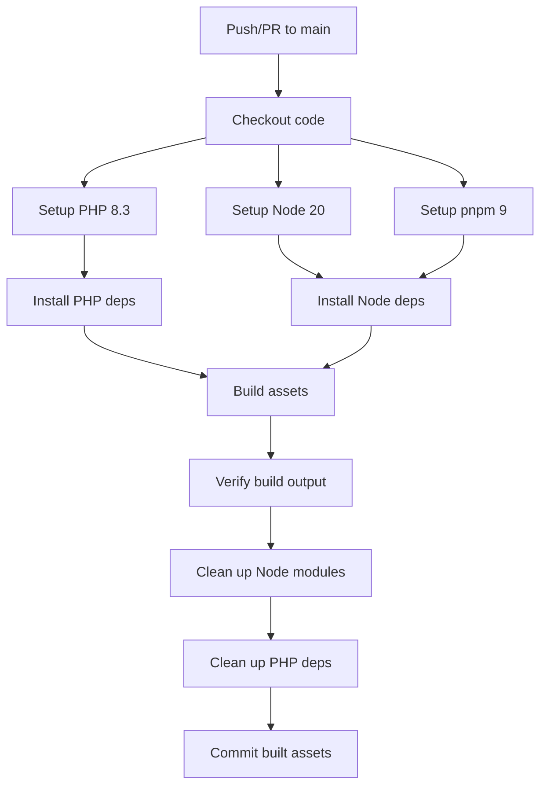

# GitHub Actions Workflow

This document explains the GitHub Actions workflow used to build the plugin assets.

## Workflow Diagram

## Workflow Steps Explanation

1. **Trigger**: The workflow runs on push to main branch or pull request to main
2. **Setup**: Configures the environment with PHP 8.3, Node.js 20, and pnpm 9
3. **Install**: Installs both PHP (Composer) and JavaScript (pnpm) dependencies
4. **Build**: Runs the production build process with `pnpm run prod`
5. **Verify**: Checks that the dist directory exists and lists its contents
6. **Cleanup**: Removes development dependencies (node_modules)
7. **Optimize PHP**: Reinstalls Composer dependencies without dev dependencies
8. **Commit**: Commits the built assets back to the repository

## Troubleshooting

If the workflow fails, check the following common issues:

1. **Build Script**: Ensure `pnpm run prod` works locally
2. **Dependencies**: Make sure all required dependencies are in package.json
3. **Output Directory**: Verify webpack is configured to output to `dist/`
4. **Git Permissions**: Workflow needs permissions to push changes

## Notes

- We use `skip_dirty_check: false` to avoid committing if no files changed
- We set `fetch-depth: 0` to ensure git history is available for committing
- The workflow includes conditional checks for composer.json
